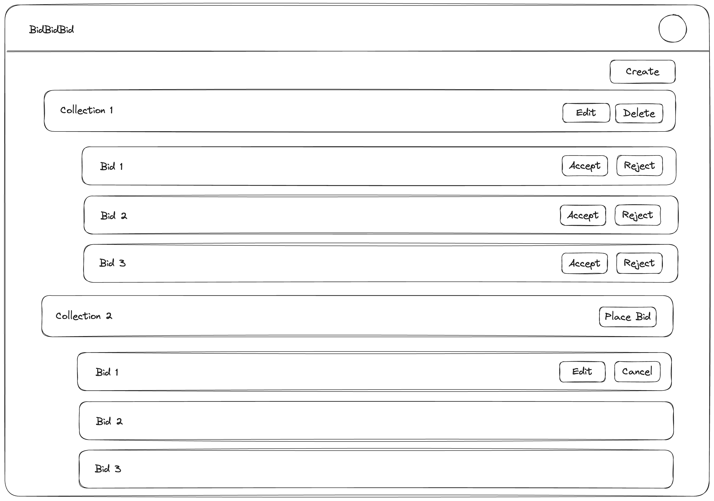

# Luxor Full-stack Applications Challenge: Bidding System

Welcome to Luxor's Application Engineer Coding Challenge.

### Guidelines

- Simple, well written and commented code is preferred over over-engineered models. You should be able to explain all of the steps and decisions you've made.
- For the coding part of this challenge you are expected to use Typescript or Javascript.

### Using Next.JS (or Remix/any other stack) build a simple bidding system with the following criteria:

```
# Base Schema (feel free to add more columns as you see fits):
collections {
    id,
    name,
    descriptions,
    stocks (qty),
    price,
},
bids {
    id,
    collection_id,
    price,
    user_id,
    status (pending, accepted, rejected),
}
user {
    id,
    name,
    email
}
```

1. Create a dataset base on schema above.
   - atleast 100 collections
   - atleast 10 bids per collection
   - atleast 10 users
   - you can use an orm like prisma or drizzle connected to a postgres db,
   - or just use json file as mock data.
2. Create an endpoint to fetch the following (can be Nextjs Api or RSC/Server Action)
   - list of collections
   - list of bids, params: collection_id
   - create/update/delete collection
   - create/update/delete bid
   - accept bid (should reject other bids), params: collection_id, bid_id
3. Create a nested table/section to display the list of collections, with
   - list of bids under each collection
   - if collection owner
     - an icon/button to update/delete collection
     - an icon/button to accept bid
   - otherwise, an icon/button to add/edit/cancel bid
4. Forms (modals or page): create/update collection, create/update bid

### Example Layout



**_Design is just an example, you can do nested cards or nested table or others, totally up to you_**
**_Feel free to utilize [shadcn](ui.shadcn.com) and other ui lib for the frontend part._**

### Judging Criteria

- Code Quality
- Code Structure
- UX
- Performance (how you render components and call api)
- Authentication is optional (feel free to mock users), bonus if you can implement it.

### What you need to deliver

- The project itself with your code
- Document how to run the code (on the README)
- Answer the following questions (can be all in a README file):
  - How would you monitor the application to ensure it is running smoothly?
  - How would you address scalability and performance?
  - Trade-offs you had to choose when doing this challenge (the things you would do different with more time and resources)

All of this should be delivered on a repository that you will create on github and share with:

- thomas.cook@luxor.tech
- albert.ilagan@luxor.tech
- mon@luxor.tech
- carl@luxor.tech
- eddie@luxor.tech
- macky.bugarin@luxor.tech
- alexander.armua@luxor.tech
